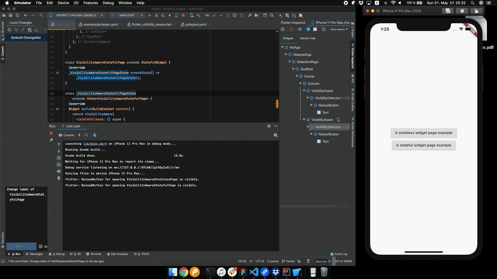

# flutter_visibility_aware

A tiny widget which is aware of its visibility based on `WidgetsBindingObserver` and 
https://pub.dev/packages/visibility_detector

# Intro

```dart

    // Just wrapper on the widget which wants to handle visible or invisible events. 

    VisibilityAware(
      visibleCallback: () async {
        debugPrint("$this is visible.");
      },
      invisibleCallback: () async {
        debugPrint("$this is invisible.");
      },
      child: Scaffold(
        appBar: AppBar(),
        body: Container(
          color: Colors.white,
          child: Center(
            child: Text(
              "$this",
            ),
          ),
        ),
      ),
    );

```



# Dependencies

[visibility_detector](https://pub.dev/packages/visibility_detector)

## Getting Started

This project is a starting point for a Dart
[package](https://flutter.dev/developing-packages/),
a library module containing code that can be shared easily across
multiple Flutter or Dart projects.

For help getting started with Flutter, view our 
[online documentation](https://flutter.dev/docs), which offers tutorials, 
samples, guidance on mobile development, and a full API reference.
